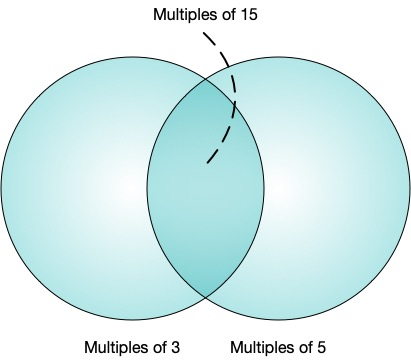

\[[^](../README.md)] \[[>](./p0002.md)]

# Problem 1: Multiples of 3 or 5

## The link to the problem

- [Multiples of 3 or 5](https://projecteuler.net/problem=1)

## My approach

The answer is *Multiples of 3* $+$ *Multiples of 5* $-$ *Multiples of 15*.



The sum of multiples of 3 less than 1000 is:

$$
\begin{align}
3 + 6 + \ldots + 999 & = \frac{(3 + 999) \cdot 333}{2} \\
                     & = \frac{(3 + (999 - (999 \bmod 3))) \cdot \lfloor \frac{999}{3} \rfloor}{2} \\
                     & = \frac{(3 + ((1000 - 1) - ((1000 - 1) \bmod 3))) \cdot \lfloor \frac{1000 - 1}{3} \rfloor}{2}
\end{align}
$$

In the same way, the sum of multiples of 5 less than 1000 is:

$$
\begin{align}
5 + 10 + \ldots + 995 & = \frac{(5 + 995) \cdot 199}{2} \\
                      & = \frac{(5 + (999 - (999 \bmod 5))) \cdot \lfloor \frac{999}{5} \rfloor}{2} \\
                      & = \frac{(5 + ((1000 - 1) - ((1000 - 1) \bmod 5))) \cdot \lfloor \frac{1000 - 1}{5} \rfloor}{2}
\end{align}
$$

In ohter words, the sum of multiples of N less than M is:

$$
\frac{(N + ((M - 1) - ((M - 1) \bmod N))) \cdot \lfloor \frac{M - 1}{N} \rfloor}{2}
$$

## Other approach

In the Julia programming language, StepRange can be treated as collections, so it can be written by set operations.

```julia
sum(union(3:3:(1000 - 1), 5:5:(1000 - 1)))
```

Naturally, this code is easy to understand but not fast.
