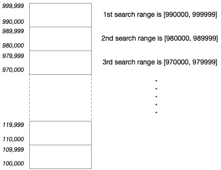

# Problem 4: Largest Palindrome Product

## The link to the problem

- [Largest Palindrome Product](https://projecteuler.net/problem=4)

## My approach

To solve such a problem is only brute-force search.
However, since this is a problem of finding the maximum value,
the computational complexity can be reduced by dividing the search range and searching large numbers first.

