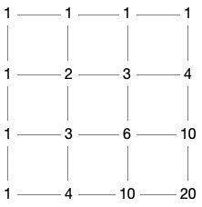
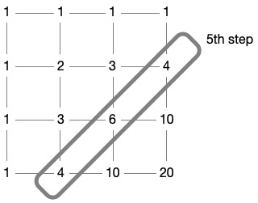

# Problem 15: Lattice Paths

## The link to the problem

- [Lattice Paths](https://projecteuler.net/problem=15)

## My approach

In a $20$ x $20$ grid, this problem is equivalent to the combination of 20 right arrows and 20 down arrows.
The number of routes therefore is $C(40, 20)$.

$$
C(40, 20) = \binom{40}{20} = \frac{40!}{20! \cdot 20!} = \frac{40 \cdot 39 \cdot \ \cdots \ \cdot 21}{20 \cdot 19 \cdot \ \cdots \ \cdot 1}
$$

The numerator of above, $\displaystyle \prod_{k=21}^{40} k = 335367096786357081410764800000 \gt 2^{64}$, is very large.
If the programming language you use provides arbitrary-precision arithmetic, just use it.
If not, we need other method to solve the problem.

One way is to prevent overflow as the following.

$$
\prod_{k=1}^{20} \frac{k + 20}{k}
$$

Another way is to find the number of routes to each vertex of the lattice in order from the upper left corner.
The following is an example of a $3$ x $3$ grid.

Starting in the upper left corner, each step is as follows.

$$
\begin{array}{c|l}
\hline
step & number \ of \ routes \\
\hline
1 & [1] \\
2 & [1, 1] \\
3 & [1, 2, 1] \\
4 & [1, 3, 3, 1] \\
5 & [4, 6, 4] \\
6 & [10, 10] \\
7 & [20] \\
\hline
\end{array}
$$

For example, the state at step 5 is as follows.

In this way, the value will not exceed $2^{64}$ in a $20$ x $20$ grid.

