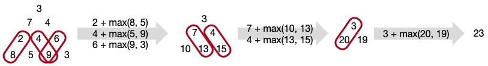

\[[<](./p0017.md)] \[[^](../README.md)] | \[[>](./p0019.md)]

# Problem 18: Maximum Path Sum I

## The link to the problem

- [Maximum Path Sum I](https://projecteuler.net/problem=18)

## My approach

This problem can be solved easily by folding in from the goal not start. 
Here is an example of a sample triangle given in the problem statement.

