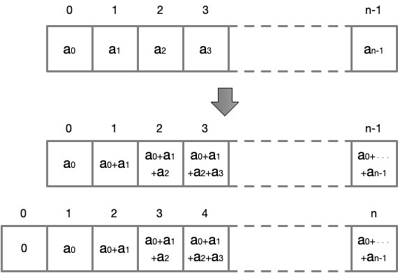

# Problem 50: Consecutive Prime Sum

## The link to the problem

- [Consecutive Prime Sum](https://projecteuler.net/problem=50)

## My approach

This problem is easily solved by creating a cumulative sum (running total) from prime numbers.

The cumulative sum of the sequence `[a, b, c, ...]` are `[a, a+b, a+b+c, ...]`.
In some cases, inserting an element `0` at the beginning of the cumulative sum sequence
may make the solving process easier.

