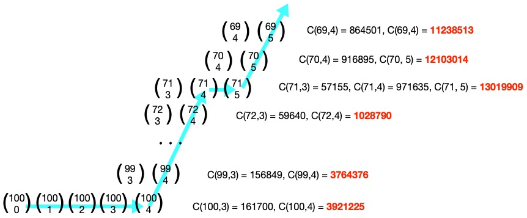

# Problem 53: Combinatoric Selections

## The link to the problem

- [Combinatoric Selections](https://projecteuler.net/problem=53)

## My approach

First of all, the following equation holds in combinatorics.

$$
{n \choose r} = {n \choose n - r} \ \ \text{for} \ 0 \le r \le n
$$

Let's consider when $n=100$. the first term greater than one-milion is $\displaystyle {100 \choose 4} = 3921225$.
Thus, the number of terms greater than one-million is 93 $(= 100 + 1 - 4 * 2)$ when $n=100$.

$$
{100 \choose 0} \ {100 \choose 1} \ {100 \choose 2} \ {100 \choose 3} \ \ | \ \ \ 
{100 \choose 4} \ \cdots \ {100 \choose 96} \ \ | \ \ \ 
{100 \choose 97} \ {100 \choose 98} \ {100 \choose 99} \ {100 \choose 100}
$$

And then, use [Pascal's triangle](https://en.wikipedia.org/wiki/Pascal%27s_triangle) to solve this problem.

$$
{n \choose r} = {n - 1 \choose r - 1} + {n - 1 \choose r} \ \ \text{for} \ 0 \le r \le n
$$

Assume that $\displaystyle {n \choose k}$ is the first term greater than one-million,
in other words, $\displaystyle {n \choose k - 1} \le 1000000$ and $\displaystyle {n \choose k} > 1000000$.
We know the following:

- $\displaystyle {n - 1 \choose k - 1} \le 1000000$ because $\displaystyle {n - 1 \choose k - 2} + {n - 1 \choose k - 1} = {n \choose k - 1} \le 1000000$
- It is not sure if $\displaystyle {n - 1 \choose k}$ is greater than one-million

Using the above information, we can search for terms larger than one-million efficiently on Pascal's triangle.

## Note

I took a note of an equation for central binomial coefficient a few years ago, but I forget where I saw it.

$$
\begin{align}
{2n \choose n} & = {2(n-1) \choose n-1} \cdot (3 + \frac{n-2}{n}) \\
               & = {2(n-1) \choose n-1} \cdot \frac{4n-2}{n}
\end{align}
$$
