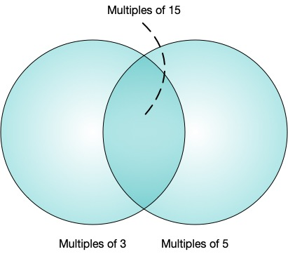

\[[^](../README_ja.md)] \[[>](./p0002.md)]

# Problem 1: Multiples of 3 or 5

## The link to the problem

- [Multiples of 3 or 5](https://projecteuler.net/problem=1)

## My approach

求める答えは「*3の倍数* $+$ *5の倍数* $-$ *15の倍数*」である。



1000未満の3の倍数の和は下記の様に計算できる。

$$
\begin{align}
3 + 6 + \ldots + 999 & = \frac{(3 + 999) \cdot 333}{2} \\
                     & = \frac{(3 + (999 - (999 \bmod 3))) \cdot \lfloor \frac{999}{3} \rfloor}{2} \\
                     & = \frac{(3 + ((1000 - 1) - ((1000 - 1) \bmod 3))) \cdot \lfloor \frac{1000 - 1}{3} \rfloor}{2}
\end{align}
$$

同様に、5の倍数の和を表してみる。

$$
\begin{align}
5 + 10 + \ldots + 995 & = \frac{(5 + 995) \cdot 199}{2} \\
                      & = \frac{(5 + (999 - (999 \bmod 5))) \cdot \lfloor \frac{999}{5} \rfloor}{2} \\
                      & = \frac{(5 + ((1000 - 1) - ((1000 - 1) \bmod 5))) \cdot \lfloor \frac{1000 - 1}{5} \rfloor}{2}
\end{align}
$$

つまり、 $M$ 未満の $N$ の倍数の和は、下記の公式で求めることができる。

$$
\frac{(N + ((M - 1) - ((M - 1) \bmod N))) \cdot \lfloor \frac{M - 1}{N} \rfloor}{2}
$$

## Other approach

JuliaではStepRangeをコレクションとして扱えるので、集合演算で答えを求めることができる。

```julia
sum(union(3:3:(1000 - 1), 5:5:(1000 - 1)))
```

和の公式に比べると意味は理解しやすいですが、速度は早くないです。

