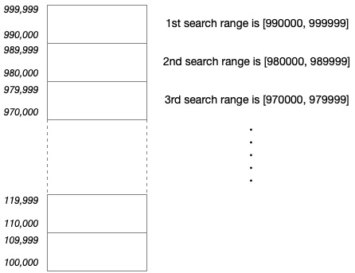

\[[<](./p0003.md)] \[[^](../README_ja.md)] \[[>](./p0005.md)]

# Problem 4: Largest Palindrome Product

## The link to the problem

- [Largest Palindrome Product](https://projecteuler.net/problem=4)

## My approach

このような問題は総当たり探索が解法の基本になります。
しかし、この問題は条件を満たす最大値を求めるものなので、探索範囲を区切って値の大きい範囲から調べることにより解答が素早く見つかることが期待できます。

