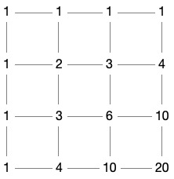
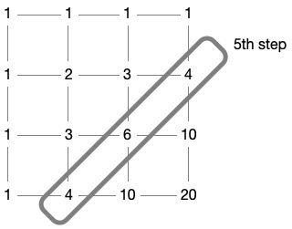

\[[<](./p0014.md)] \[[^](../README_ja.md)] \[[>](./p0016.md)]

# Problem 15: Lattice Paths

## The link to the problem

- [Lattice Paths](https://projecteuler.net/problem=15)

## My approach

20x20 のグリッドの場合、この問題は 20 個の右向き矢印と 20 個の下向き矢印の組み合わせ数を求める問題と同値である。つまり答えの経路数は $C(40, 20)$ である。

$$
C(40, 20) = \binom{40}{20} = \frac{40!}{20! \cdot 20!} = \frac{40 \cdot 39 \cdot \ \cdots \ \cdot 21}{20 \cdot 19 \cdot \ \cdots \ \cdot 1}
$$

上記の式において、分子は $\displaystyle \prod_{k=21}^{40} k = 335367096786357081410764800000 \gt 2^{64}$ となり非常に大きい。
多倍長整数が使えるなら何も考える必要はないが、使えない場合は他の解法が必要になる。

一つの手段として、桁溢れが起きないよう順番に計算する方法がある。

$$
\prod_{k=1}^{20} \frac{k + 20}{k}
$$

他の手段として、格子上の各点についてスタート地点である左上からの経路数を順番に数えていく方法もある。例として、3x3 のグリッドの場合を下記に示す。

左上から出発して、ステップごとの状態は以下のとおり。

$$
\begin{array}{c|l}
\hline
step & number \ of \ routes \\
\hline
1 & [1] \\
2 & [1, 1] \\
3 & [1, 2, 1] \\
4 & [1, 3, 3, 1] \\
5 & [4, 6, 4] \\
6 & [10, 10] \\
7 & [20] \\
\hline
\end{array}
$$

例えば、5 番目のステップ時点では下図のようになる。

この方法だと、20x20 のグリッドでも経路数は $2^{64}$ を越えることはない。

