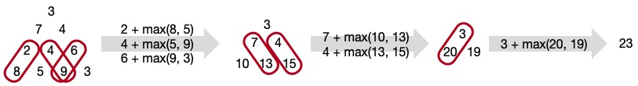

\[[<](./p0017.md)] \[[^](../README_ja.md)] \[[>](./p0019.md)]

# Problem 18: Maximum Path Sum I

## The link to the problem

- [Maximum Path Sum I](https://projecteuler.net/problem=18)

## My approach

スタート地点から探す場合は動的計画法(Dynamic Programming)の出番ですが、この問題の場合はゴール側から畳み込むのが良いと思います。
問題文で提示されているサンプルの三角形による具体的な例は下図のとおり。

