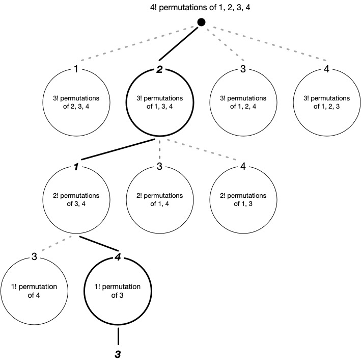

\[[<](./p0023.md)] \[[^](../README_ja.md)] \[[>](./p0025.md)]

# Problem 24: Lexicographic Permutations

## The link to the problem

- [Lexicographic Permutations](https://projecteuler.net/problem=24)

## My approach

順列は辞書順に並んでいるので、階乗で割り続けることで答えを求めることができる。

例えば、集合 ${1, 2, 3, 4}$ を元にした 8 番目の順列はを求めるには下記のようになる。

1. 位置を 0 オリジンで表す ($8$ -> $7$)。初期データとして一番最初の順列を配列として保持する `[1, 2, 3, 4]`。
2. $7 \div \mathbf{3!} = 1$ rem. $\textcolor{red}{1}$. 商は 1 なので、配列の 2 番目の要素 ***2*** が最初の数字となる。この要素を配列から取り除き、更新後の配列は `[1, 3, 4]` になる。
3. $\textcolor{red}{1} \div \mathbf{2!} = 0$ rem. $\textcolor{red}{1}$. 商は 0 なので、配列の 1 番目の要素 ***1*** が次の数字となる。この要素を配列から取り除き、更新後の配列は `[3, 4]` になる。
4. $\textcolor{red}{1} \div \mathbf{1!} = 1$ rem. $\textcolor{red}{0}$. 商は 1 なので、配列の 2 番目の要素 ***4*** が次の数字となる。この要素を配列から取り除き、更新後の配列は `[3]` になる。
5. $\textcolor{red}{0} \div \mathbf{0!} = 0$ rem. $0$. 商は 0 なので、配列の 1 番目の要素 ***3*** が次の数字となる。この要素を配列から取り除き、更新後の配列は空配列 `[]` になる。
6. 答えは `2143`

