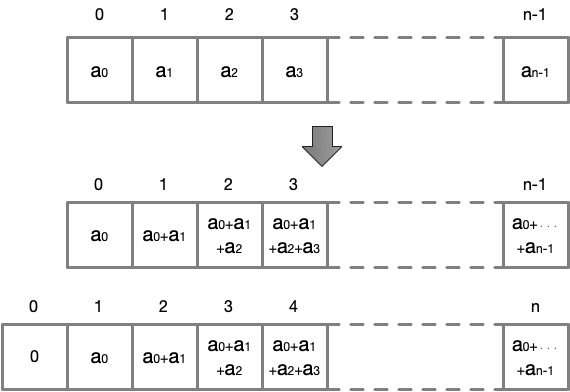

\[[<](./p0049.md)] \[[^](../README_ja.md)] \[[>](./p0051.md)]

# Problem 50: Consecutive Prime Sum

## The link to the problem

- [Consecutive Prime Sum](https://projecteuler.net/problem=50)

## My approach

この問題は、素数の累積和を使えば簡単に解くことができます。

累積和とは、数列 `[a, b, c, ...]` の要素を順に足し合わせたもので `[a, a+b, a+b+c, ...]` のようになります。
解決する問題次第では、先頭に要素 `0` を挿入すると、処理が容易になることもあります。

