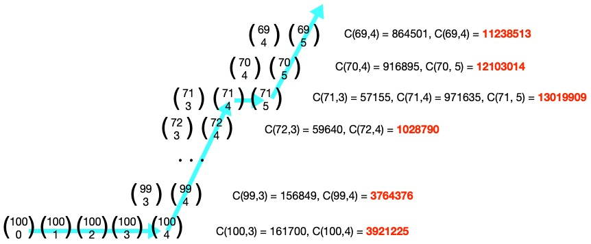

\[[<](./p0052.md)] \[[^](../README_ja.md)] \[[>](./p0054.md)]

# Problem 53: Combinatoric Selections

## The link to the problem

- [Combinatoric Selections](https://projecteuler.net/problem=53)

## My approach

まず始めに、組み合わせについて下記の式が成り立ちます。

$$
{n \choose r} = {n \choose n - r} \ \ \text{for} \ 0 \le r \le n
$$

さて、 $n=100$ の場合を調べます。最初に 100 万を超えるのは $\displaystyle {100 \choose 4} = 3921225$ です。
したがって $n=100$ のときに 100 万を超える組み合わせの数は 93 $(= 100 + 1 - 4 * 2)$ 個です。

$$
{100 \choose 0} \ {100 \choose 1} \ {100 \choose 2} \ {100 \choose 3} \ \ | \ \ \ 
{100 \choose 4} \ \cdots \ {100 \choose 96} \ \ | \ \ \ 
{100 \choose 97} \ {100 \choose 98} \ {100 \choose 99} \ {100 \choose 100}
$$

そしてパスカルの三角形([Pascal's triangle](https://en.wikipedia.org/wiki/Pascal%27s_triangle))が問題を解くのに使えます。

$$
{n \choose r} = {n - 1 \choose r - 1} + {n - 1 \choose r} \ \ \text{for} \ 0 \le r \le n
$$

$\displaystyle {n \choose k}$ を最初に 100 万を超える組み合わせと仮定します。
つまり、 $\displaystyle {n \choose k - 1} \le 1000000$ かつ $\displaystyle {n \choose k} > 1000000$ です。

パスカルの三角形より

- $\displaystyle {n - 1 \choose k - 1} \le 1000000$ である（理由は $\displaystyle {n - 1 \choose k - 2} + {n - 1 \choose k - 1} = {n \choose k - 1} \le 1000000$ だから)
- $\displaystyle {n - 1 \choose k}$ が 100 万を超えるか否かはわからない

上記の情報から、パスカルの三角形を使うと 100 万を超える組み合わせを効率良く探すことができます。

## Note

何年か前に下記の式をメモしたのですが、どこで見かけたか忘れました。

$$
\begin{align}
{2n \choose n} & = {2(n-1) \choose n-1} \cdot (3 + \frac{n-2}{n}) \\
               & = {2(n-1) \choose n-1} \cdot \frac{4n-2}{n}
\end{align}
$$

